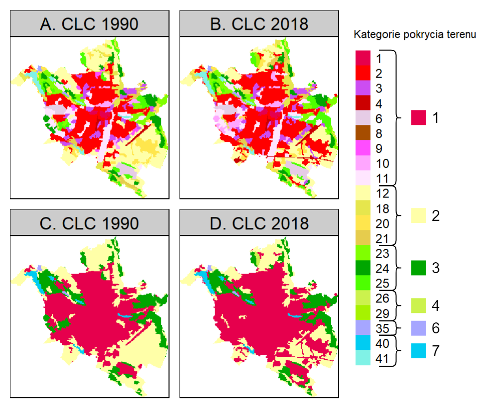

# Metody {#metody}

## Reklasyfikacja danych CLC {#reklasyfikacja}

W celu ułatwienia interpretacji wyników, klasy CLC zostały poddane reklasyfikacji.
Reklasyfikacja to proces ponownego przypisania jednej lub więcej wartości w zestawie danych rastrowych do nowych wartości wyjściowych.
Dane o pokryciu terenu w programie CORINE udostępniane są na najniższym, trzecim poziomie podziału kategorii.
Wykorzystanie wszystkich klas pokrycia terenu występujących na obszarze Polski doprowadziłoby do nadmiaru informacji i tym samym zwiększenia trudności interpretacji wyników.
Rycina \@ref(fig:rycina41) przedstawia przykład wpływu reklasyfikacji na ilość kategorii pokrycia terenu występujących na obszarze miasta Poznań.
Aby uniknąć powyższej sytuacji, klasy zostały zgrupowane do oryginalnego podziału dla pierwszego poziomu CLC, z wyjątkiem lasów i ekosystemów naturalnych, gdzie zastosowano podział dla poziomu drugiego.

W wyniku reklasyfikacji ilość klas pokrycia terenu została zmniejszona z 33 klas poziomu trzeciego występujących na obszarze Polski do 7.
Otrzymano następujące kategorie pokrycia terenu:

1. tereny antropogeniczne,
2. tereny rolne,
3. lasy,
4. tereny krzewiaste,
5. tereny z rzadszą roślinnością,
6. obszary podmokłe,
7. obszary wodne.

```{r rycina41, echo=FALSE, fig.cap="Porównanie danych CLC dla obszaru miasta Poznań przed i po reklasyfikacji", out.width=400}

```


## Wykorzystane oprogramowanie {#oprogramowanie}

Wszystkie obliczenia i ryciny zostały przygotowane za pomocą języka *R* [@R-base].
Najważniejszym pakietem tego języka, który umożliwił przeprowadzenie analizy zmian struktur przestrzennych, był pakiet *motif* [@R-motif].
Pakiet ten umożliwia przekształcenie kategorycznych danych rastrowych, niosących wyłącznie informacje o pojedynczych komórkach, w sygnatury przestrzenne, będące statystycznym opisem pewnych struktur przestrzennych występujących wewnątrz rastra.
Jedną z najbardziej podstawowych sygnatur przestrzennych jest kompozycja.
Stanowi ona podsumowanie ilości komórek danej kategorii występujących na analizowanym obszarze.
Obok kompozycji wyróżnia się także konfigurację, która stanowi opis ilości komórek danych kategorii występujących w sąsiedztwie komórek innych kategorii.

Wyróżnia się także metody opisu struktur przestrzennych będące połączeniem wcześniej wspomnianych sygnatur.
Jedną z takich metod jest między innymi macierz współwystępowania, którą tworzy się poprzez zliczenie wszystkich par sąsiadujących ze sobą komórek.
W wyniku otrzymywana jest macierz o wymiarach k na k, gdzie k jest równe liczbie klas występujących w rastrze kategorycznym.
Wewnątrz macierzy współwystępowania, wartości przekątne związane są z kompozycją rastra, natomiast wartości pionowe i poziome - z jego konfiguracją.
Sygnaturą wykorzystaną do obliczeń w tej pracy był histogram współwystępowania, będący przekształceniem macierzy współwystępowania do postaci jednowymiarowej.

Wizualizacje danych przestrzennych stworzone zostały z wykorzystaniem pakietu *tmap* [@R-tmap], natomiast do wizualizacji danych ilościowych wykorzystany został pakiet *ggplot2* [@R-ggplot2].


### Pakiet Motif
<!-- Wytłumaczyć działanie pakietu motif i co nim można zrobić, trochę jak działa itp -->
Pakiet motif jest narzędziem o otwartym kodzie źródłowym, umożliwiającym analizy struktur przestrzennych dla dowolnych kategorycznych danych rastrowych za pomocą sygnatur przestrzennych.
Sygnatury można obliczyć zarówno dla obszarów regularnych, takich jak siatka jednakowych kwadratów, jak i obszarów nieregularnych, jak np. jednostki podziału administracyjnego.
Funkcje wewnątrz pakietu pozwalają na obliczenie siedmiu różnych sygnatur przestrzennych, takich jak: 

- kompozycja,
- macierz współwystępowania,
- histogram współwystępowania,
- ważona macierz współwystępowania,
- ważony histogram współwystępowania,
- zintegrowana macierz współwystępowania,
- zintegrowany histogram współwystępowania.

Dodatkowo motif umożliwia użytkownikom na stworzenie własnych sygnatur przestrzennych poprzez wykorzystanie funkcji zdefiniowanych wcześniej przez użytkowników wewnątrz funkcji pakietu.
Pakiet zawiera także narzędzia umożliwiające wykonanie analiz przestrzennych, takich jak wyszukiwanie struktur przestrzennych, wykrywanie ich zmian oraz grupowanie obszarów o podobnej strukturze przestrzennej.

Poniżej, przedstawiony został przykład zastosowania pakietu motif w celu obliczenia macierzy współwystępowania ("coma").
W pakiecie motif do obliczania sygnatur przestrzennych służy funkcja *lsp_singature()*.
Jako pierwszy argument funkcja przyjmuje obszar badań w postaci rastra kategorycznego.
W argumencie *type* należy określić rodzaj sygnatury przestrzennej, którą chcemy obliczyć.
Argument *window* określa rozmiar kwadratów, wewnątrz których obliczana będzie sygnatura.
Poniżej przedstawiona została funkcja umożliwiająca obliczenie macierzy współwystępowania ("coma").
Jako obszar badań podane zostały dane CLC dla całej Polski z roku 1990, natomiast oczekiwany rozmiar okien, wewnątrz których wykonywane będą obliczenia ustawiony został jako 100 komórek rastra.

```{r,warning=FALSE}
library(motif)
library(stars)

land_cover = read_stars("data/clc_poland.tif")
coma = lsp_signature(land_cover,
                     type = "coma",
                     window = 100)

coma
```

W wyniku obliczeń otrzymany został obiekt klasy *lsp* zawierający trzy kolumny:

- id - unikatowy identyfikator każdego obszaru
- na_prop - udział komórek *NA* w danym obszarze
- signature - sygnatura obliczona dla danego obszaru

Sygnaturę przestrzenną wybranego obszaru można obejrzeć poprzez wydzielenie jej z kolumny *signature*:

```{r}
coma$signature[[24]]
```


## Przygotowanie danych do analizy struktury przestrzennej **może jakaś inna nazwa?** {#analiza}
<!-- W tej części można dodać jakiś diagram pokazujący kolejne kroki analizy. Trzeba też dokładniej te kroki opisać (proszę postawić się w miejscu osoby, która chciałaby zrobić to samo co Pan, ale dla innego kraju) -->
Rycina \@ref(fig:rycina42) przedstawia poszczególne kroki wykonane w celu pozyskania wyników umożliwiających dalszą analizę struktur przestrzennych na wyodrębnionych obszarach.
Podany przykład jest wyłącznie uproszczeniem czynności wykonanych w rzeczywistości, ponieważ w sekcji "Analiza zmian pokrycia terenu" zawarty został wyłącznie proces pozyskania danych wyjściowych do analizy struktur przestrzennych na poziomie powiatów.

```{r rycina42, echo=FALSE, fig.cap="Czynności wykonane w celu otrzymania wyników umożliwiających analizę struktury przestrzennej obszarów powiatów.", out.width=400}
knitr::include_graphics("figures/workflow.pdf")
```

<!-- przycięcie danych -->
Wszystkie dane wykorzystane do przygotowania analizy zostały szczegółowo omówione w rozdziale \@ref(materialy).
Ze względu na to, że pobrane dane rastrowe CLC obejmują obszar większy niż obszar analizowany w tej pracy, pierwszym krokiem przygotowania danych było przycięcie danych rastrowych do granic Polski.

<!-- reklasyfikacja -->
Następnie, otrzymane rastry zostały poddane reklasyfikacji.
Proces ten został dokładniej opisany w sekcji \@ref(reklasyfikacja).
Dane CLC oryginalnie udostępniane są na trzecim poziomie podziału kategorii pokrycia terenu.
Oznacza to, że dane CLC dla wybranego regionu w Europie mogą zawierać aż 44 różne kategorie pokrycia terenu.
W celu uniknięcia nadmiaru informacji powstałej przy próbie porównania zmian między taką ilością kategorii, dane zostały zreklasyfikowane do 7 kategorii.
Przykład wpływu reklasyfikacji na ilość zawartych informacji na przykładzie obszaru miasta Poznań ilustruje rycina \@ref(fig:rycina41).

W wyniku przygotowania danych, otrzymane zostały rastry kategoryczne CLC dla lat 1990 i 2018 zawierające informacje o 7 głównych kategoriach pokrycia terenu, przycięte do obszaru Polski.

<!-- analiza ilościowa zmian przestrzennych -->
Kolejny etap polegał na  wykonaniu ilościowej analizy zmian pokrycia terenu dla całego analizowanego obszaru.
W pierwszej kolejności (krok 3 na diagramie) obliczona została tabela częstotliwości występowania zreklasyfikowanych kategorii CLC w poszczególnych latach.
Tabela ta zawiera informacje o ilości komórek danej kategorii występujących na rastrze dla danego roku.
Następnie, obliczona została tabela krzyżowa (**użyć tego czy "tablica kontyngencji" - contingency table?**) zmian zreklasyfikowanych kategorii między analizowanymi latami (Tabela \@ref(tab:tabela3)).
Otrzymana tabela krzyżowa zawiera dane o wszystkich zmianach pokrycia terenu zaszłych między każdą możliwą parą kategorii pokrycia terenu.
Ostatecznie, stworzona została tabela \@ref(tab:tabela2) zawierająca podstawowe statystyki podsumowujące zmiany zaszłe na obszarze Polski w podziale na zreklasyfikowane kategorie pokrycia terenu.

Obliczone statystyki to między innymi: suma powierzchni dla lat 1990 i 2018, bilans zmian między latami, ubytki i przyrosty powierzchni w analizowanym czasie oraz procentowa zmiana stanu danej kategorii.
Podział na bilans zmian, ubytki oraz przyrosty wywodzi się z tego, że bilans zmian stanowi wyłącznie różnicę względną między stanem z roku 1990 a tym z roku 2018.
Oznacza to, że gdy w teoretycznej sytuacji dwie komórki rastra, o różnych kategoriach, zmienią swoje kategorie na kategorię drugiej komórki - bilans zmian pozostaje zerowy.
Statystyka ta nie ukazuje zmian, które zaszły w komórkach, ze względu na to, że ilość komórek tych kategorii pozostała bez zmian.
Aby uwzględnić takie zmiany, obliczono także różnicę względną między stanami z analizowanych lat w postaci ilości ubytków i przyrostów każdej kategorii.
Ubytki danej kategorii stanowią ilość komórek, które w roku 1990 należały do tej kategorii, natomiast w roku 2018 zmieniły swoją kategorię na dowolną inną.
Przyrosty danej kategorii oznaczają ilość komórek, które w roku 1990 należały do pozostałych kategorii, a w roku 2018 zmieniły swoją kategorię na tą jedną.
Zmiana między latami została obliczona jako stosunek stanu powierzchni z roku 2018 do stanu z roku 1990.
Zmiana +50% oznacza, że powierzchnia z roku 2018 stanowi 150% powierzchni z roku 1990.
Analogicznie zmiana -50% oznacza, że powierzchnia z roku 2018 stanowi 50% powierzchni z roku 1990.

<!-- analiza zmian struktur przestrzennych -->
Celem trzeciego etapu było pozyskanie obliczonych różnic w stanie struktur przestrzennych jednostek przestrzennych.
W celu trafnego stwierdzenia prawidłowości dotyczących zmian struktury przestrzennej, dane zostały przeanalizowane na trzech poziomach:

- poprzez wydobycie wartości dla kwadratów o wymiarach 100 na 100 pikseli,
- na poziomie powiatowym
- na poziomie mezoregionów.

Pojedynczy obszar powstały poprzez wyodrębnienie kwadratów o wymiarach 100 na 100 pikseli obejmuje powierzchnię 10000 ha (100 km^2^).

Do ilościowej oceny wielkości zmian każdej jednostki wykorzystuje się miary niepodobieństwa (**odmienności?**).
W tej pracy, do określenia stopnia zmian wykorzystano odległość Jensena-Shannona obliczoną dla każdej jednostki przestrzennej.
Miara ta przyjmuje wartości od 0 do 1.
Wartość 0 oznacza, że na danym obszarze między badanymi okresami nie zaszły żadne zmiany, natomiast wartość 1 oznacza brak podobieństw między analizowanymi obszarami, czyli całkowitą zmianę pokrycia terenu.
**nie wiem co jeszcze mógłbym tu dopisać, ale zdecydowanie czegoś brakuje**

Ostatnim krokiem etapu oceny zmian struktur przestrzennych było znalezienie obszarów, które w latach 1990-2018 zmieniły się najbardziej.
Aby poprawnie przeanalizować trendy zmian pokrycia terenu wśród tych obszarów, wyodrębniono po 6 najbardziej zmienionych obszarów z każdego rodzaju wykorzystanych jednostek przestrzennych (kwadraty 10 na 10km, powiaty, mezoregiony).

```{r pakiertbib, echo=FALSE, warning=FALSE}
pakiety = c("base", "motif", "tmap", "ggplot2")

knitr::write_bib(pakiety, "packages.bib", width = 60)
```
