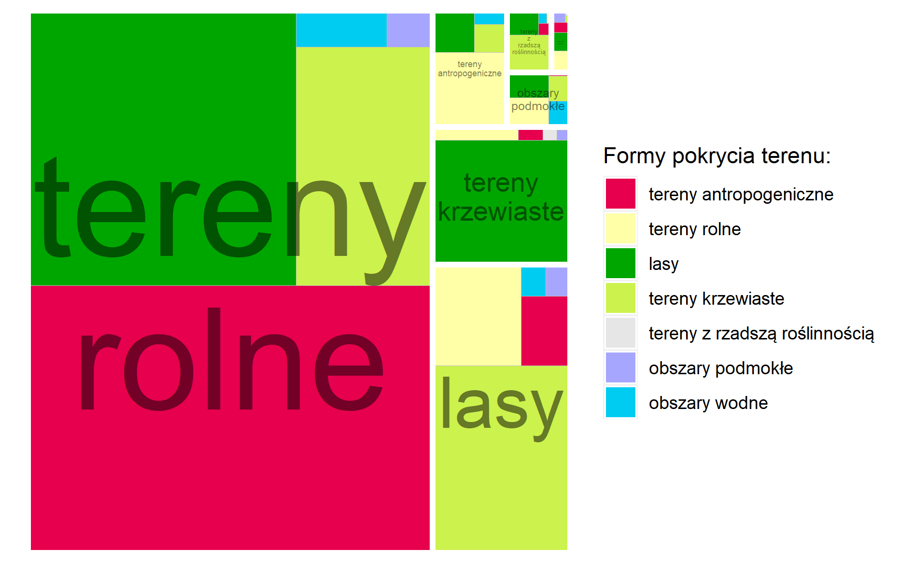
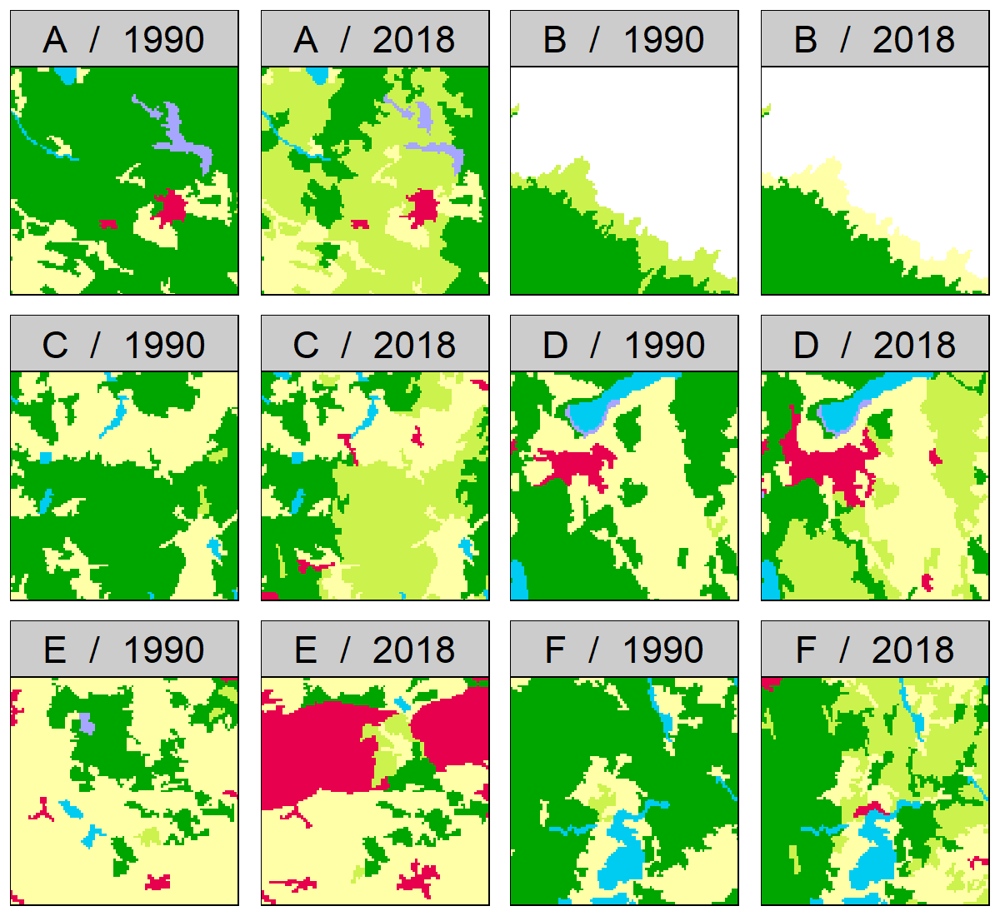
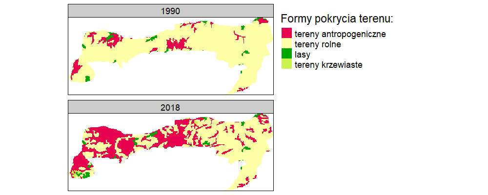

# Wyniki {#wyniki}

## Przycięcie danych CLC do granic Polski
## Reklasyfikacja


## Analiza zmian na poziomie krajowym

<!--
```{r rycina1, echo=FALSE, fig.cap="Corine Land Cover 1990 po reklasyfikacji", out.width=400}
knitr::include_graphics("figures/clc90.png")
```
```{r rycina2, echo=FALSE, fig.cap="Corine Land Cover 2018 po reklasyfikacji", out.width=400}
knitr::include_graphics("figures/clc18.png")
```

```{r rycina3, echo=FALSE, fig.cap="Binarna mapa zmian klasyfikacji", out.width=400}
knitr::include_graphics("figures/lc_bin.png")
```

```{r rycina4, echo=FALSE, fig.cap="Procentowy udział form pokrycia terenu dla roku 1990", out.width=400}
knitr::include_graphics("figures/lcpch90.png")
```
```{r rycina5, echo=FALSE, fig.cap="Procentowy udział form pokrycia terenu dla roku 2018", out.width=400}
knitr::include_graphics("figures/lcpch18.png")
```

```{r rycina6, echo=FALSE, fig.cap="Procentowy udział poszczególnych kategorii w zmianie pokrycia terenu", out.width=400}
knitr::include_graphics("figures/stacked.png")
```

```{r rycina7, echo=FALSE, fig.cap="Udział poszczególnych kategorii w zmianie pokrycia terenu", out.width=400}

```
```{r rycina8, echo=FALSE, fig.cap="Udział poszczególnych kategorii w zmianie pokrycia terenu", out.width=400}
knitr::include_graphics("figures/treemap_faceted.png")
```
-->

## Analiza zmian regularnych obszarów 10 na 10 km
<!-- Zamiast "krajobrazy lokalne" lepiej użyć regularnych obszarów x na x km". -->
```{r rycina9, echo=FALSE, fig.cap="Odległość Jensena-Shannona obliczona dla oczek siatki o wymiarach 10x10km", out.width=40}
knitr::include_graphics("figures/map_grid.png")
```
Największe zmiany na południu, południowym-zachodzie oraz centralnej części Polski.
<!-- Te podsekcje powinny się zaczynać od jednego akapitu przypominającego czytelnikom co tutaj zostało zrobione. Dopiero po tym "wstępie" można opisywać zmiany -- od tych najbardziej ogólnych do szczegółowych -->
<!-- Język tekstu jest jeszcze do poprawy, np. "lekko na wschód" -->
Najmniejsze zmiany na obszarze morza terytorialnego oraz na południu Polski na terenie Płaskowyżu Głubczyckiego.

```{r rycina12, echo=FALSE, fig.cap="Obszar z największymi zmianami w siatce 10x10km", out.width=40}
knitr::include_graphics("figures/top1_grid.png")
```
Rycina \@ref(fig:rycina12) przedstawia obszar na którym zaszły największe zmiany między analizowanymi latami.
<!-- Co to za obszar? Gdzie on jest dokładnie? -->
Ponad połowa lasów na obszarze została zastąpiona terenami krzewiastymi.
Zanik części obszarów podmokłych, także na rzecz obszarów krzewiastych.
Niewielki rozrost terenów antropogenicznych oraz terenów rolnych.

**Może dorobić do tego plot z udziałem procentowym klas dla obu lat?**
<!-- Jasne -- jeżeli czuje Pan brak wizualizacji to można ją dodać. -->
**Wtedy będzie można dokładniej opisać te najważniejsze zmiany**

```{r rycina15, echo=FALSE, fig.cap="6 obszarów z największymi zmianami w siatce 10x10km", out.width=40}

```
Spośród sześciu regularnych obszarów 10 na 10 km o największych zmianach w czasie, najbardziej zauważalnym trendem wydaje się być zmiana obszarów leśnych na tereny krzewiaste.
Kolejnym widocznym trendem jest przede wszystkim postępująca urbanizacja, t.j. rozrost terenów o charakterze antropogenicznym, co jest szczególnie widoczne na obszarze oznaczonym literą E.
Interesujacym przykładem jest obszar B.
<!-- Trzeba wyjaśnić zarówno w tekście jak i podpisie ryciny gdzie są te obszary. -->
Na tym obszarze nastąpiła istotna przemiana terenów krzewiastych w tereny rolne, co jest pewnym przełamaniem głównego trendu widocznego na pozostałych pięciu obszarach.

```{r rycina18, echo=FALSE, fig.cap="Histogram dla siatki 10x10km", out.width=40}
knitr::include_graphics("figures/hist_grid.png")
```
Powyższy histogram pokazuje, że w znacznej większości regularnych krajobrazów lokalnych nie zaszły żadne zmiany, lub były one bardzo niewielkie.

## Analiza zmian na poziomie powiatów
```{r rycina10, echo=FALSE, fig.cap="Odległość Jensena-Shannona obliczona dla powiatów", out.width=40}
knitr::include_graphics("figures/map_dist.png")
```
```{r rycina13, echo=FALSE, fig.cap="Obszar z największymi zmianami wśród powiatów", out.width=40}
knitr::include_graphics("figures/top1_dist.png")
```
```{r rycina16, echo=FALSE, fig.cap="6 obszarów z największymi zmianami wśród powiatów", out.width=40}
knitr::include_graphics("figures/top6_dist.png")
```
```{r rycina19, echo=FALSE, fig.cap="Histogram dla powiatów", out.width=40}
knitr::include_graphics("figures/hist_dist.png")
```

## Analiza zmian na poziomie mezoregionów
```{r rycina11, echo=FALSE, fig.cap="Odległość Jensena-Shannona obliczona dla mezoregionów", out.width=40}
knitr::include_graphics("figures/map_meso.png")
```
```{r rycina14, echo=FALSE, fig.cap="Obszar z największymi zmianami wśród mezoregionów", out.width=40}

```
```{r rycina17, echo=FALSE, fig.cap="6 obszarów z największymi zmianami wśród mezoregionów", out.width=40}
knitr::include_graphics("figures/top6_meso.png")
```
```{r rycina20, echo=FALSE, fig.cap="Histogram dla mezoregionów", out.width=40}
knitr::include_graphics("figures/hist_meso.png")
```
