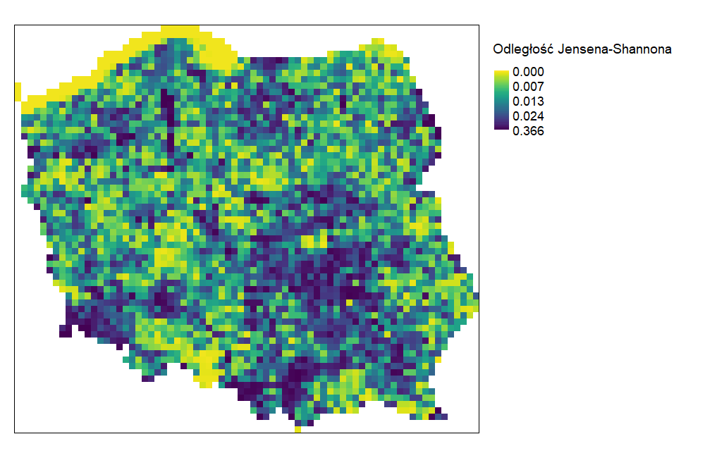
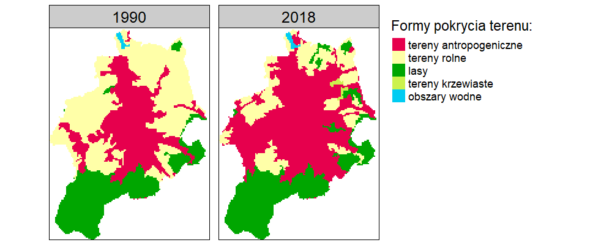
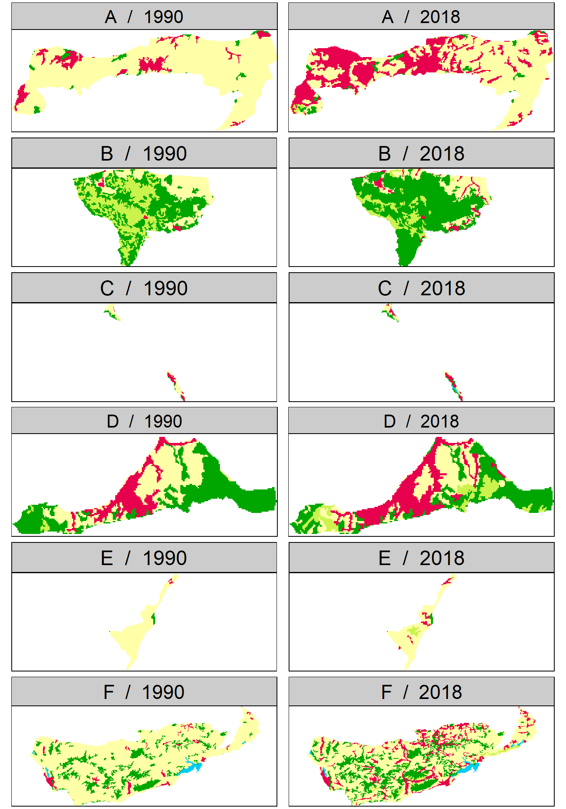

# Wyniki {#wyniki}

## Analiza zmian na poziomie krajowym

## Analiza zmian na poziomie krajobrazów lokalnych
```{r rycina9, echo=FALSE, fig.cap="Odległość Jensena-Shannona obliczona dla oczek siatki o wymiarach 10x10km", out.width=40}

```
Najwięsze zmiany na południu, południowym-zachodzie oraz centralnej części Polski lekko na wschód.
Najmniejsze zmiany na obszarze morza terytorialnego oraz na południu Polski na terenie Płaskowyżu Głubczyckiego.

```{r rycina12, echo=FALSE, fig.cap="Obszar z największymi zmianami w siatce 10x10km", out.width=40}
knitr::include_graphics("figures/top1_grid.png")
```
Rycina przedstawia obszar na którym zaszły największe zmiany między analizowanymi latami.
Ponad połowa lasów na obszarze została zastąpiona terenami krzewiastymi.
Zanik części obszarów podmokłych, także na rzcz obszarów krzewiastych.
Niewielki rozrost terenów antropogenicznych oraz terenów rolnych.

**Może dorobić do tego plot z udziałem procentowym klas dla obu lat?**
**Wtedy będzie można dokładniej opisać te najważniejsze zmiany**

```{r rycina15, echo=FALSE, fig.cap="6 obszarów z największymi zmianami w siatce 10x10km", out.width=40}
knitr::include_graphics("figures/top6_grid.png")
```
Spośród sześciu regularnych krajobrazów lokalnych o największych zmianach w czasie, najbardziej zauważalnym trendem wydaje się być zmiana obszarów leśnych na tereny krzewiaste.
Kolejnym widocznym trendem jest przede wszystkim postępująca urbanizacja, t.j. rozrost terenów o charakterze antropogenicznym, co jest szczególnie widoczne na obszarze oznaczonym literą E.
Interesujacym przykładem jest obszar B.
Na tym obszarze nastąpiła istotna przemiana terenów krzewiastych w tereny rolne, co jest pewnym przełamaniem głównego trendu widocznego na pozostałych pięciu obszarach.

```{r rycina18, echo=FALSE, fig.cap="Histogram dla siatki 10x10km", out.width=40}
knitr::include_graphics("figures/hist_grid.png")
```
Powyższy histogram pokazuje, że w znacznej większości regularnych krajobrazów lokalnych nie zaszły żadne zmiany, lub były one bardzo niewielkie.


**czy 0.3 w tym wypadku jest równoznaczne z tym, że 1/3 obszaru uległo zmianie?**


## Analiza zmian na poziomie powiatów
```{r rycina10, echo=FALSE, fig.cap="Odległość Jensena-Shannona obliczona dla powiatów", out.width=40}
knitr::include_graphics("figures/map_dist.png")
```
```{r rycina13, echo=FALSE, fig.cap="Obszar z największymi zmianami wśród powiatów", out.width=40}

```
```{r rycina16, echo=FALSE, fig.cap="6 obszarów z największymi zmianami wśród powiatów", out.width=40}
knitr::include_graphics("figures/top6_dist.png")
```
```{r rycina19, echo=FALSE, fig.cap="Histogram dla powiatów", out.width=40}
knitr::include_graphics("figures/hist_dist.png")
```

## Analiza zmian na poziomie mezoregionów
```{r rycina11, echo=FALSE, fig.cap="Odległość Jensena-Shannona obliczona dla mezoregionów", out.width=40}
knitr::include_graphics("figures/map_meso.png")
```
```{r rycina14, echo=FALSE, fig.cap="Obszar z największymi zmianami wśród mezoregionów", out.width=40}
knitr::include_graphics("figures/top1_meso.png")
```
```{r rycina17, echo=FALSE, fig.cap="6 obszarów z największymi zmianami wśród mezoregionów", out.width=40}

```
```{r rycina20, echo=FALSE, fig.cap="Histogram dla mezoregionów", out.width=40}
knitr::include_graphics("figures/hist_meso.png")
```

<!--
Część **Wyniki** może składać się z jedego lub więcej rozdziałów. 
Każdy z tych rozdziałów powinien mieć tytuł adekwatny do swojej treści.

Rozdziały wynikowe powinny korzystać z wiedzy opisanej w poprzednich rozdziałach (Rozdziały \@ref(lit), \@ref(materialy), \@ref(metody)).
W przypadku prac analitycznych, ich treść powinna przedstawiać kolejne etapy eksploracji i analizy danych.
W przypadku prac technicznych, treść tych rozdziałów powinnna opisywać stworzone narzędzia, a następnie pokazywać ich zastosowanie/a.

W przypadku prac technicznych warto pokazywać fragmenty napisanego rozwiązania lub jego wywołania używając bloków kodu.

```{r}
moja_funkcja = function(x){
  cat(x, "rządzi!")
}
moja_funkcja("Autor tej pracy")
```
-->
