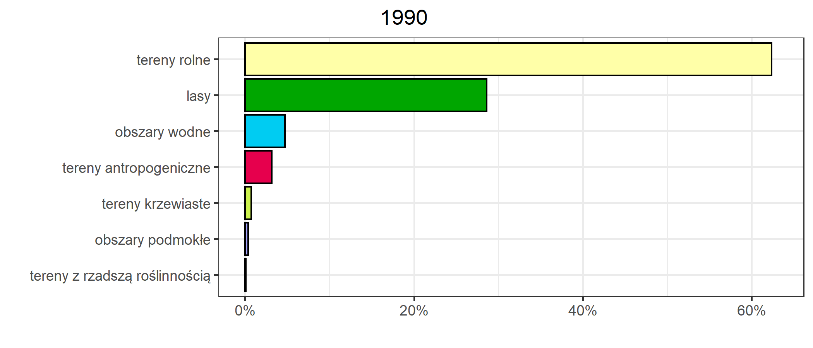
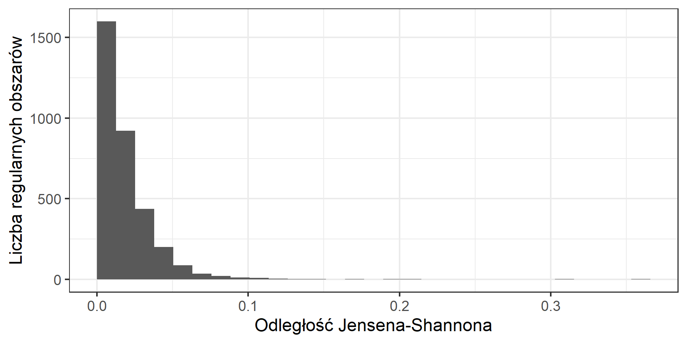
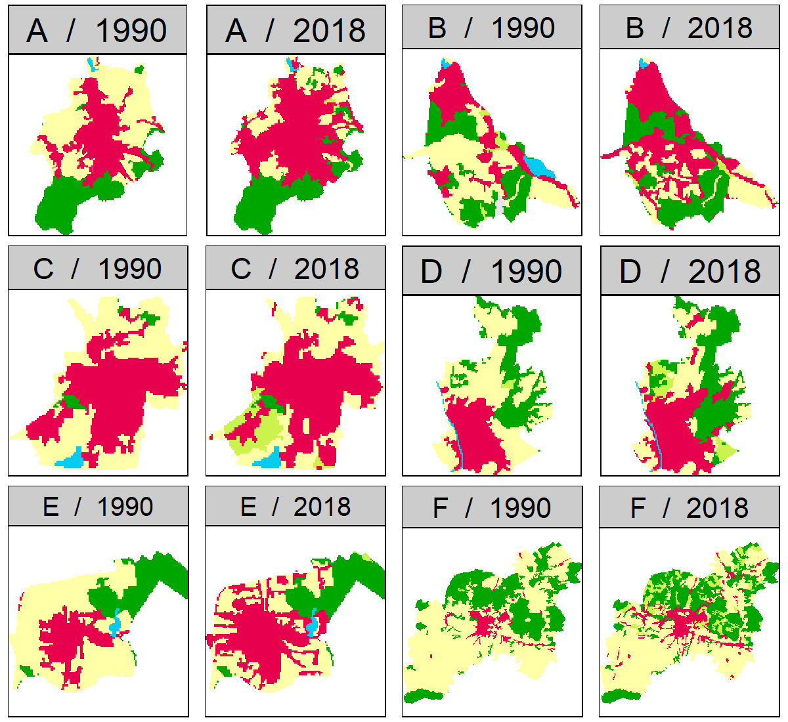
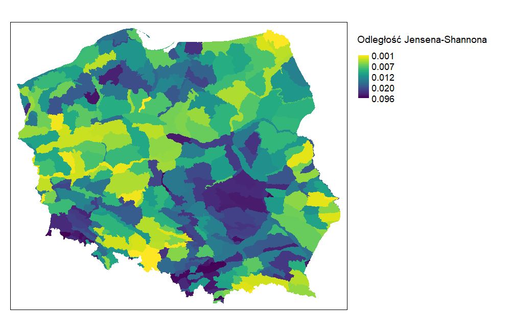
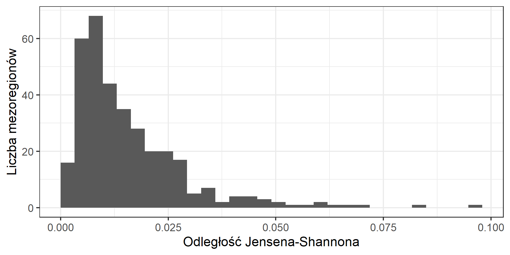

# Wyniki {#wyniki}

## Analiza zmian na poziomie krajowym

Jednym z celów tej pracy było sporządzenie map opartych o dane CORINE Land Cover dla lat 1990 i 2018 zreklasyfikowane do 7 kategorii pokrycia terenu, aby umożliwić ogólną ocenę stanu pokrycia terenu dla tych lat.
Mapy te zostały przedstawione poniżej (rycina \@ref(fig:rycina1), rycina \@ref(fig:rycina2)).
**Pomimo zastosowania wyłącznie 7 kategorii, analiza zmian pokrycia terenu w skali całego kraju na podstawie wizualnego porównania tych map byłaby prawdopodobnie równie trudna, co błędna. <- do przepisania**
W celu zminimalizowania liczby błędów w analizie zmian w skali krajowej, wykonana została analiza ilościowa zmian pokrycia terenu, oparta o podejście statystyczne.

**dodać cyfry przed nazwami kategorii**
```{r rycina1, echo=FALSE, fig.cap="Corine Land Cover 1990 po reklasyfikacji", out.width=400}
knitr::include_graphics("figures/clc90.png")
```
```{r rycina2, echo=FALSE, fig.cap="Corine Land Cover 2018 po reklasyfikacji", out.width=400}
knitr::include_graphics("figures/clc18.png")
```

Udział poszczególnych kategorii pokrycia terenu w całkowitej powierzchni Polski przedstawiony został na rycinach \@ref(fig:rycina4) i \@ref(fig:rycina5).

**złączyć w jedną rycinę**
```{r rycina4, echo=FALSE, fig.cap="Procentowy udział form pokrycia terenu dla roku 1990", out.width=400}

```
```{r rycina5, echo=FALSE, fig.cap="Procentowy udział form pokrycia terenu dla roku 2018", out.width=400}
knitr::include_graphics("figures/lcpch18.png")
```


### Analiza ilościowa zmian pokrycia terenu

Zmiany pokrycia terenu w latach 1990-2018 w Polsce objęły powierzchnię 2556965 ha, co stanowi 7,9% całkowitej powierzchni kraju (Tabela \@ref(tab:tabela2)).
Największe zmiany pokrycia terenu w tym czasie dotyczyły wzrostu ilości terenów antropogenicznych.
Tereny te zyskały 902804 ha powierzchni, co oznacza wzrost o 87,9%.
Najdynamiczniej rozwinęły się tereny krzewiaste, które zwiększyły swoją powierzchnię o 159% względem początku analizowanego okresu.
Największe straty odnotowano na terenach rolnych, ich powierzchnia w roku 2018 zmniejszyła się o 1758978 ha.
Pomimo największych strat spośród wszystkich analizowanych kategorii, powierzchnia terenów rolnych zmniejszyła się jedynie o 8,7%.
Ilość terenów z rzadszą roślinnością zwiększyła się w najmniejszym stopniu i jednocześnie tereny te odnotowały najbardziej dynamiczną stratę powierzchni w analizowanym okresie.
Tereny z rzadszą roślinnością odnotowały najmniejszy przyrost oraz łączną utratę 59,1% powierzchni, co stanowi najbardziej dynamiczną stratę powierzchni w stosunku do stanu z 1990 roku spośród analizowanych kategorii pokrycia terenu.
Kategorią, która zmieniła się w najmniejszym stopniu były obszary wodne.
Całkowita powierzchnia tych terenów wzrosła wyłącznie o 2,3%.
Niewielkie powiększenie powierzchni lasów (5.19%) spowodowane było wysokimi ubytkami powierzchni w stosunku do ich przyrostów.
Ponad 3% powierzchni obszarów leśnych, w roku 2018 zmieniło kategorię pokrycia terenu.

```{r tabela2, echo=FALSE}
library(magrittr)
library(kableExtra)

lc_changes = read.csv("data/lc_changes.csv", header = TRUE)
lc_changes = lc_changes[, 2:ncol(lc_changes)]
rownames(lc_changes) = NULL
colnames(lc_changes) = c("Kategoria pokrycia terenu",
                         "Powierzchnia w 1990r. [ha]",
                         "Powierzchnia w 2018r. [ha]",
                         "Bilans zmian [ha]",
                         "Zmiana między latami [%]",
                         "Część całkowitej powierzchni w 1990r. [%]",
                         "Część całkowitej powierzchni w 2018r. [%]",
                         "Ubytki [ha]",
                         "Przyrosty [ha]"
                         )

lc_changes = lc_changes[, c(1:5,8,9)]
lc_changes = lc_changes[, c(1,2,3,4,6,7,5)]
# lc_changes[2:6] = lc_changes[2:6] /100

# lc_changes = lc_changes %>% 
#   dplyr::mutate_if(is.numeric, format, nsmall = 2)


kbl(lc_changes,
    booktabs = TRUE,
    linesep="",
    # escape = FALSE,
    align = c("l","r","r","r","r","r","r"),
    caption = "Zmiany pokrycia terenu w latach 1990-2018 na podstawie danych CLC") %>%
  kable_styling(latex_options="scale_down", font_size = 8) %>% 
  kable_classic(full_width = T) %>%
  column_spec(1, bold = T)

```

Tabela \@ref(tab:tabela3) przedstawia wynikową tabelę krzyżową, wykonaną w celu oszacowania ilościowych zmian między zreklasyfikowanymi kategoriami pokrycia terenu dla danych rastrowych dla lat 1990 i 2018.
Kategorie z roku 1990 ułożone są w wierszach tabeli, natomiast w kolumny stanowią kategorie z roku 2018.
Oznacza to, że np. kolumna tabeli oznaczona kategorią "1" informuje nas o liczbie komórek z roku 1990, w których komórki zmieniły się na kolejne kategorie.
Przecięcia wierszy i kolumn oznaczonych tymi samymi kategoriami informują o liczbie komórek rastra, które w analizowanych latach się nie zmieniły.
Numeracja kategorii w tabeli odpowiada kolejności kategorii przedstawionej w podrozdziale \@ref(reklasyfikacja).

**dodać kolumne i rząd z latami**
```{r tabela3, echo=FALSE, message=FALSE, warning=FALSE}
library(magrittr)
library(kableExtra)
library(dplyr)

options(knitr.kable.NA = '')

options(scipen=999)
cont_table = read.csv("data/cont_table_export.csv", header = FALSE)
# cont_table[2:8, 2:8] = cont_table[2:8, 2:8] / 100

# cont_table = cont_table %>% 
#   mutate_if(is.numeric, format, nsmall = 2)

cont_table[1,2:8] = as.character(as.integer(cont_table[1,2:8]))


rownames(cont_table) = NULL
colnames(cont_table) = NULL

cont_table[1,1] = NA

kbl(cont_table,
    booktabs = TRUE,
    format = "latex",
    linesep="",
    caption = "Macierz zmian pokrycia terenu w latach 1990-2018 [ha]") %>%
  kable_classic(full_width = F) %>%
  column_spec(1, bold = T, border_right = TRUE) %>%
  row_spec(1, bold = T, align = "r", hline_after = T) %>%
  row_spec(2:8, align = "r")

```

Na podstawie tabeli \@ref(tab:tabela3) opracowana została rycina \@ref(fig:rycina8), przedstawiająca najważniejsze trendy zmian pokrycia terenu w sposób graficzny.
Kategorie pokrycia terenu zostały podzielone na osobne wykresy, reprezentujące przyrosty kategorii w 2018 roku.
Kolory wewnątrz wykresów informują o tym, jaką część przyrostów powierzchni danej kategorii stanowią komórki, które w roku 1990 należały do pozostałych kategorii.

```{r rycina8, echo=FALSE, fig.cap="Udział poszczególnych kategorii w zmianie pokrycia terenu", out.width=400}
knitr::include_graphics("figures/treemap_faceted.png")
```

Analizując rycinę \@ref(fig:rycina8) można zauważyć pewne tendencje wśród zmian pokrycia terenu.
Najważniejsze trendy zmian pokrycia terenu, stanowiące największe straty pokrycia terenu w kategorii pierwotnej:

- tereny antropogeniczne -> tereny rolne,
- tereny rolne -> tereny antropogeniczne i obszary leśne,
- obszary leśne -> tereny krzewiaste,
- tereny krzewiaste -> obszary leśne,
- tereny z rzadszą roślinnością -> tereny krzewiaste,
- obszary podmokłe -> tereny rolne i obszary leśne,
- obszary wodne -> tereny rolne i obszary leśne.


### Lokalizacje największych zmian w skali krajowej

Lokalizacje komórek rastra, które w okresie 1990-2018 zmieniły kategorie pokrycia terenu, przedstawia rycina \@ref(fig:rycina3).
Analizując rycinę, zauważyć można występowanie zmian zarówno o charakterze rozproszonym, jak i skoncentrowanym.
Największe zmiany o charakterze rozproszonym zauważyć można w południowej części kraju na obszarze całego województwa śląskiego oraz zachodniej części województwa małopolskiego.
Dużą ilością rozproszonych zmian pokrycia terenu cechują się także województwo mazowieckie, województwo świętokrzyskie, centralna część województwa podkarpackiego oraz zachodnia część województwa dolnośląskiego.
Znaczna większość zmian na tych obszarach stanowi zmianę z terenów rolnych w tereny antropogeniczne.

Obszary, na których zaszły znaczne zmiany pokrycia terenu o charakterze skoncentrowanym wymienione zostały poniżej, wraz z wyjaśnieniem, w jakim miejscu znajdują się te obszary, i z jakimi zmianami kategorii są związane.
Duże obszary zmienione w wyniku działalności człowieka:
**dodać źródła?**

1. Kopalnia Węgla Brunatnego Bełchatów i zwałowisko zewnętrzne Góra Kamieńska, będąca jego skutkiem:
lasy i tereny rolne zostały przekształcone w tereny antropogeniczne.
2. Rezerwat przyrody Jeziorsko:
obszary wodne powstałe z terenów podmokłych.
3. Kopalnia Węgla Brunatnego Adamów:
tereny leśne i rolne przekształcone w tereny antropogeniczne, powstanie sztucznego zbiornika wodnego.
4. Kopalnia Węgla Brunatnego Konin:
tereny rolne przekształcone w tereny antropogeniczne, powstanie sztucznego zbiornika wodnego.
5. Ośrodek Szkolenia Poligonowego Wojsk Lądowych Żagań:
różne przejścia między kategoriami, głównie zmiana terenów z rzadszą roślinnością w tereny krzewiaste oraz terenów krzewiastych w tereny zalesione.
6. Kopalnia Węgla Brunatnego Turów:
tereny rolne przekształcone głównie w tereny antropogeniczne.
7. Zalew Siemianówka:
zmiana terenów podmokłych w obszary wodne oraz zmiana terenów rolnych w tereny podmokłe, skutek spiętrzenia wód w zbiorniku zaporowym.

Duże obszary zmienione w wyniku zjawisk naturalnych:

8. Bory Tucholskie:
zmiana ogromnych połaci terenów leśnych w tereny krzewiaste, konsekwencje wichury i nawałnicy z 2017 roku.
9. Mazury, nadleśnictwo Pisz:
przemiana terenów krzewiastych w tereny leśne, skutki trąb powietrznych z 2002 roku oraz działań zapobiegających dalszego zniszczenia lasów poprzez wykonanie licznych pasów przeciwpożarowych.
10. Kotlina Raciborska, nadleśnictwo Rudy Raciborskie:
pożar lasu w nadleśnictwie Rudy Raciborskie z 1992 roku, który strawił 9062 ha lasów, następnie w roku 2017 zniszczenia lasów spowodowane trąbą powietrzną.

```{r rycina3, echo=FALSE, fig.cap="Binarna mapa zmian klasyfikacji dla lat 1990-2018", out.width=400}

```

<!--
```{r rycina6, echo=FALSE, fig.cap="Procentowy udział poszczególnych kategorii w zmianie pokrycia terenu", out.width=400}
knitr::include_graphics("figures/stacked.png")
```

```{r rycina7, echo=FALSE, fig.cap="Udział poszczególnych kategorii w zmianie pokrycia terenu", out.width=400}
knitr::include_graphics("figures/treemap_main.png")
```
-->

## Analiza zmian struktur przestrzennych dla wyodrębnionych jednostek przestrzennych
<!-- Te podsekcje powinny się zaczynać od jednego akapitu przypominającego czytelnikom co tutaj zostało zrobione. Dopiero po tym "wstępie" można opisywać zmiany -- od tych najbardziej ogólnych do szczegółowych -->
Ocena struktur przestrzennych wykonana została poprzez podział analizowanego obszaru na mniejsze jednostki przestrzenne.
W celu prawidłowej oceny zmian, obliczenia wykonano dla trzech różnych jednostek przestrzennych: 

- dla regularnych obszarów o wymiarach 100 na 100 pikseli (10 na 10 km),
- na poziomie powiatowym.
<!-- - na poziomie mezoregionów. -->

Następnie, ocena zmian struktur przestrzennych wykonana została za pomocą metod opartych o sygnatury przestrzenne.
Do określenia stopnia zmian między tymi samymi jednostkami przestrzennymi w analizowanych latach wykorzystano odległość Jensena-Shannona.
Parametr ten przyjmuje wartości od 0 do 1.
Wartość 0 oznacza brak zmian w strukturze przestrzennej, natomiast wartość 1 wskazuje na ich całkowitą zmianę. 
Na podstawie wartości tego parametru, wyodrębnione zostało 6 najbardziej zmienionych obszarów, dla każdego rodzaju wykorzystanych jednostek przestrzennych, w celu przeanalizowania zmian, które zaszły na tych obszarach.


### Analiza zmian regularnych obszarów 10 na 10 km
```{r rycina9, echo=FALSE, fig.cap="Odległość Jensena-Shannona obliczona dla oczek siatki o wymiarach 10x10km", out.width=400}
knitr::include_graphics("figures/map_grid.png")
```


Wartości obliczonych odległości Jensena-Shannona dla kwadratów 10 na 10 km przedstawione zostały na rycinie \@ref(fig:rycina9).
Podobnie jak na rycinie \@ref(fig:rycina3), duże ilości zmian struktury przestrzennej widoczne są głównie w południowej części kraju. 
Największe zmiany widoczne są na obszarze województw: świętokrzyskiego, małopolskiego, śląskiego oraz dolnośląskiego.
Najmniejsze zmiany zauważyć można na obszarze morza terytorialnego oraz na południu Polski na terenie Płaskowyżu Głubczyckiego.

<!--
```{r rycina12, echo=FALSE, fig.cap="Obszar z największymi zmianami w siatce 10x10km", out.width=400}
knitr::include_graphics("figures/top1_grid.png")
```
-->

```{r rycina15, echo=FALSE, fig.cap="6 obszarów z największymi zmianami w siatce 10x10km. A - Zachodnia część gminy Czersk, B - Wschodnia część gminy Lutowiska, granica Polski z Ukrainą, C - Mezoregion Bory Tucholskie, D - Północna część gminy Pisz, E - Centralna część Kopalni Węgla Brunatnego Bełchatów, F - Mezoregion Bory Tucholskie. Obszar przylegający północną krawędzią do obszaru C.", out.width=400}
knitr::include_graphics("figures/top6_grid.png")
```
<!-- A - Zachodnia część gminy Czersk, -->
<!-- B - Wschodnia część gminy Lutowiska, granica Polski z Ukrainą, -->
<!-- C - Mezoregion Bory Tucholskie, -->
<!-- D - Północna część gminy Pisz, -->
<!-- E - Centralna część Kopalni Węgla Brunatnego Bełchatów, -->
<!-- F - Mezoregion Bory Tucholskie. Obszar przylegający północną krawędzią do obszaru C. -->

Rycina \@ref(fig:rycina15) przedstawia sześć regularnych obszarów 10 na 10 km o największych zmianach pokrycia terenu w latach 1990-2018.
Wśród zmian na tych obszarach, najbardziej zauważalnym trendem jest zmiana obszarów leśnych na tereny krzewiaste.
Kolejnym widocznym trendem jest przede wszystkim postępująca antropopresja w postaci rozrostu terenów o charakterze antropogenicznym.
Proces ten jest szczególnie widoczny na obszarze oznaczonym literą E, który przedstawia centralną część Kopalni Węgla Brunatnego Bełchatów.
Literą A oznaczony został obszar, na którym zaszły największe zmiany między analizowanymi latami.
Obszar ten swoim zasięgiem obejmuje głównie zachodnią część gminy Czersk, znajdującej się w południowej części województwa pomorskiego.
Obszar ten został spustoszony przez nawałnicę w 2017 roku.
Analizując powyższą rycinę, łatwo zauważyć, że latach 1990-2018 ogromna ilość lasów na tym obszarze została zastąpiona przez tereny krzewiaste.
W północno-wschodniej części tego obszaru widoczna jest zmiana części obszarów podmokłych, także na rzecz obszarów krzewiastych.
Interesujacym przykładem jest obszar B, obejmujący granicę Polski z Ukrainą we wschodniej części gminy Lutowiska.
Na tym obszarze nastąpiła prawie całkowita przemiana terenów krzewiastych w tereny rolne, co jest pewnym przełamaniem głównego trendu widocznego na pozostałych pięciu obszarach.

```{r rycina18, echo=FALSE, fig.cap="Histogram dla siatki 10x10km", out.width=400}

```

Określenie udziału obszarów o określonym stopniu zmian pokrycia terenu umożliwia sporządzony histogram widoczny na rycinie \@ref(fig:rycina18).
Prawoskośny rozkład histogramu, z dominantą będącą wartością 0 odległości Jensena-Shannona oznacza, że w znacznej większości regularnych obszarów 10 na 10km nie zaszły żadne zmiany, lub były one bardzo niewielkie.
Obszary o największych zmianach przedstawione na rycinie \@ref(fig:rycina15) stanowią na tym histogramie wartości ekstremalne.

### Analiza zmian na poziomie powiatów

```{r rycina10, echo=FALSE, fig.cap="Odległość Jensena-Shannona obliczona dla powiatów", out.width=400}
knitr::include_graphics("figures/map_dist.png")
```
Wśród powiatów (Rycina \@ref(fig:rycina10)), najwyższe wartości odległości Jensena-Shannona zauważalne są w tych samych lokalizacjach, co dla regularnych obszarów 10 na 10 km.
Poza tymi obszarami, wysokie wartości parametru osiągnęła także duża część miast na prawach powiatu.

<!--
```{r rycina13, echo=FALSE, fig.cap="Obszar z największymi zmianami wśród powiatów", out.width=400}
knitr::include_graphics("figures/top1_dist.png")
```
-->

```{r rycina16, echo=FALSE, fig.cap="6 obszarów z największymi zmianami wśród powiatów", out.width=400}

```

```{r rycina19, echo=FALSE, fig.cap="Histogram dla powiatów", out.width=400}
knitr::include_graphics("figures/hist_dist.png")
```

<!--
### Analiza zmian na poziomie mezoregionów

```{r rycina11, echo=FALSE, fig.cap="Odległość Jensena-Shannona obliczona dla mezoregionów", out.width=400}

```
```{r rycina14, echo=FALSE, fig.cap="Obszar z największymi zmianami wśród mezoregionów", out.width=400}
knitr::include_graphics("figures/top1_meso.png")
```
```{r rycina17, echo=FALSE, fig.cap="6 obszarów z największymi zmianami wśród mezoregionów", out.width=400}
knitr::include_graphics("figures/top6_meso.png")
```
```{r rycina20, echo=FALSE, fig.cap="Histogram dla mezoregionów", out.width=400}

```
-->

### Porównanie z wynikami innych badań
***Musi się Pan gdzieś pod koniec pracy (najlepiej przed Podsumowaniem) odnieść do innych podobnych badań (może być tych polskich do 2012 i np. tych moich globalnych( -- co Panu wszyszło podobnego, co innego, etc.***


