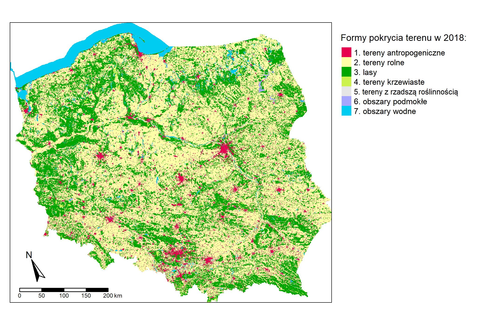
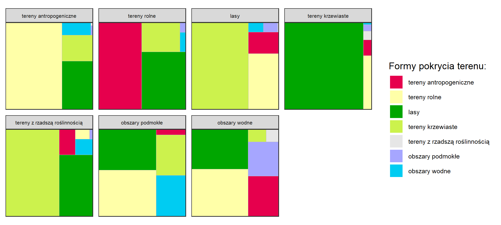
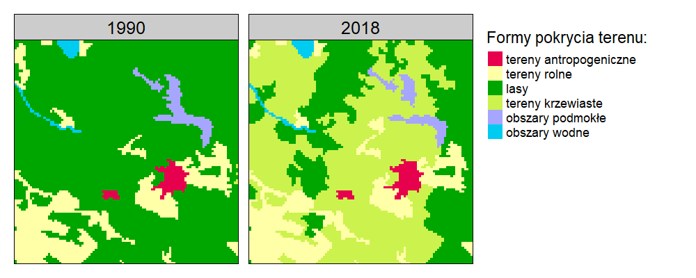
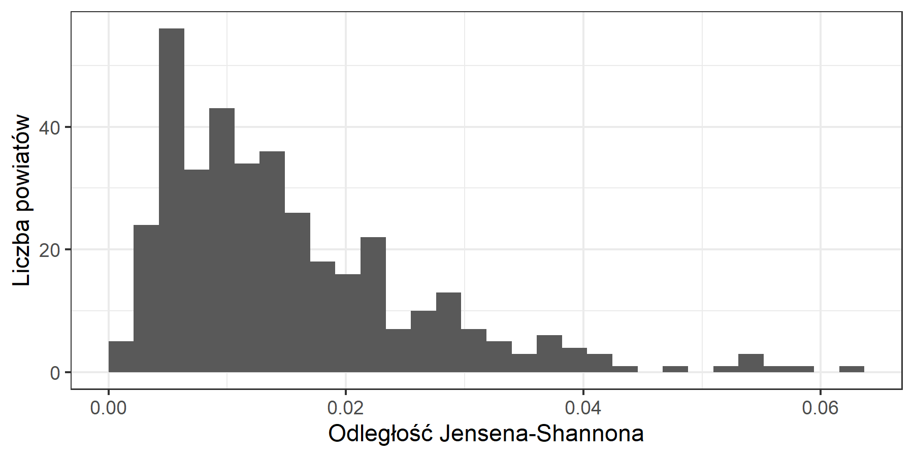

# Wyniki {#wyniki}

## Analiza zmian na poziomie krajowym

Zmiany pokrycia terenu w latach 1990-2018 w Polsce objęły powierzchnię 25569,65 km^2^, co stanowi 7,9% całkowitej powierzchni kraju (Tabela \@ref(tab:tabela2)).
Największe zmiany pokrycia terenu w tym czasie dotyczyły wzrostu ilości terenów antropogenicznych.
Tereny te zyskały 9028,04 km^2^ powierzchni, co oznacza wzrost o 87,9%.
Najdynamiczniej rozwinęły się tereny krzewiaste, które zwiększyły swoją powierzchnię o 159% względem początku analizowanego okresu.
Największe straty odnotowano na terenach rolnych, ich powierzchnia w roku 2018 zmniejszyła się o 17589,78 km^2^.
Pomimo największych strat spośród wszystkich analizowanych kategorii, powierzchnia terenów rolnych zmniejszyła się jedynie o 8,7%.
Ilość terenów z rzadszą roślinnością zwiększyła się w najmniejszym stopniu i jednocześnie tereny te odnotowały najbardziej dynamiczną stratę powierzchni w analizowanym okresie.
Tereny z rzadszą roślinnością odnotowały najmniejszy przyrost oraz łączną utratę 59,1% powierzchni, co stanowi najbardziej dynamiczną stratę powierzchni w stosunku do stanu z 1990 roku spośród analizowanych kategorii pokrycia terenu.
Kategorią, która zmieniła się w najmniejszym stopniu były obszary wodne. Całkowita powierzchnia tych terenów wzrosła wyłącznie o 2,3%.

```{r tabela2, echo=FALSE}
library(magrittr)
library(kableExtra)

lc_changes = read.csv("data/lc_changes.csv", header = TRUE)
lc_changes = lc_changes[, 2:ncol(lc_changes)]
rownames(lc_changes) = NULL
colnames(lc_changes) = c("Kategoria pokrycia terenu",
                         "Powierzchnia w 1990r. [km^2^]",
                         "Powierzchnia w 2018r. [km^2^]",
                         "Bilans zmian [km^2^]",
                         "Zmiana między latami [%]",
                         "Część całkowitej powierzchni w 1990r. [%]",
                         "Część całkowitej powierzchni w 2018r. [%]",
                         "Ubytki [km^2^]",
                         "Przyrosty [km^2^]"
                         )

lc_changes = lc_changes[, c(1:5,8,9)]
lc_changes = lc_changes[, c(1,2,3,4,6,7,5)]
lc_changes[2:6] = lc_changes[2:6] /100

kbl(lc_changes,
    booktabs = TRUE,
    linesep="",
    caption = "Zmiany pokrycia terenu w latach 1990-2018 na podstawie danych CORINE Land Cover") %>%
  kable_styling(latex_options="scale_down", font_size = 6) %>% 
  kable_classic(full_width = T) %>%
  column_spec(1, bold = T)

```

Lokalizacje, na których zaszły zmiany pokrycia terenu przedstawia rycina \@ref(fig:rycina3).
Największą ilość zmian zauważyć można w południowej części kraju na obszarze całego województwa śląskiego oraz zachodniej części województwa małopolskiego.
Dużą ilością zmian pokrycia terenu o rozproszonym charakterze cechują się także województwo mazowieckie, województwo świętokrzyskie, centralna część województwa podkarpackiego oraz zachodnia część województwa dolnośląskiego.
Analizując mapę zauważyć można także obszary na których zaszły znaczne zmiany pokrycia terenu o charakterze skoncentrowanym.

1. Kopalnia Węgla Brunatnego Bełchatów i zwałowisko zewnętrzne Góra Kamieńska, będąca jego skutkiem.
Lasy i tereny rolne zostały przekształcone w tereny antropogeniczne.
2. Kopalnia Węgla Brunatnego Konin
Tereny rolne przekształcone w tereny antropogeniczne, powstanie sztucznego zbiornika wodnego.
3. Rezerwat przyrody Jeziorsko
Obszary wodne powstałe z terenów podmokłych
4. Kopalnia Węgla Brunatnego Turów
Tereny rolne przekształcone głównie w tereny antropogeniczne.
5. Ośrodek Szkolenia Poligonowego Wojsk Lądowych Żagań
Różne przejścia między kategoriami, głównie zmiana terenów z rzadszą roślinnością w tereny krzewiaste oraz terenów krzewiastych w tereny zalesione.
6. Okolice Mazurskiego Parku Krajobrazowego
Przemiana terenów krzewiastych w tereny leśne.
7. Bory Tucholskie
Zmiana terenów leśnych w tereny krzewiaste, konsekwencje trąby powietrznej z 2012 roku, która zniszczyła 520 ha lasu.
8. Nadleśnictwo Rudy Raciborskie
Pożar lasu w nadleśnictwie Rudy Raciborskie z 1992 roku. Pożar strawił 9062 ha lasów

```{r rycina3, echo=FALSE, fig.cap="Binarna mapa zmian klasyfikacji dla lat 1990-2018", out.width=400}
knitr::include_graphics("figures/lc_bin.png")
```


<!--
```{r rycina1, echo=FALSE, fig.cap="Corine Land Cover 1990 po reklasyfikacji", out.width=400}
knitr::include_graphics("figures/clc90.png")
```
```{r rycina2, echo=FALSE, fig.cap="Corine Land Cover 2018 po reklasyfikacji", out.width=400}

```

```{r rycina4, echo=FALSE, fig.cap="Procentowy udział form pokrycia terenu dla roku 1990", out.width=400}
knitr::include_graphics("figures/lcpch90.png")
```
```{r rycina5, echo=FALSE, fig.cap="Procentowy udział form pokrycia terenu dla roku 2018", out.width=400}
knitr::include_graphics("figures/lcpch18.png")
```

```{r rycina6, echo=FALSE, fig.cap="Procentowy udział poszczególnych kategorii w zmianie pokrycia terenu", out.width=400}
knitr::include_graphics("figures/stacked.png")
```

```{r rycina7, echo=FALSE, fig.cap="Udział poszczególnych kategorii w zmianie pokrycia terenu", out.width=400}
knitr::include_graphics("figures/treemap_main.png")
```
```{r rycina8, echo=FALSE, fig.cap="Udział poszczególnych kategorii w zmianie pokrycia terenu", out.width=400}

```
-->

## Analiza zmian regularnych obszarów 10 na 10 km
```{r rycina9, echo=FALSE, fig.cap="Odległość Jensena-Shannona obliczona dla oczek siatki o wymiarach 10x10km", out.width=40}
knitr::include_graphics("figures/map_grid.png")
```
Największe zmiany na południu, południowym-zachodzie oraz centralnej części Polski.
<!-- Te podsekcje powinny się zaczynać od jednego akapitu przypominającego czytelnikom co tutaj zostało zrobione. Dopiero po tym "wstępie" można opisywać zmiany -- od tych najbardziej ogólnych do szczegółowych -->
<!-- Język tekstu jest jeszcze do poprawy, np. "lekko na wschód" -->
Najmniejsze zmiany na obszarze morza terytorialnego oraz na południu Polski na terenie Płaskowyżu Głubczyckiego.

```{r rycina12, echo=FALSE, fig.cap="Obszar z największymi zmianami w siatce 10x10km", out.width=40}

```
Rycina \@ref(fig:rycina12) przedstawia obszar na którym zaszły największe zmiany między analizowanymi latami.
<!-- Co to za obszar? Gdzie on jest dokładnie? -->
Ponad połowa lasów na obszarze została zastąpiona terenami krzewiastymi.
Zanik części obszarów podmokłych, także na rzecz obszarów krzewiastych.
Niewielki rozrost terenów antropogenicznych oraz terenów rolnych.

**Może dorobić do tego plot z udziałem procentowym klas dla obu lat?**
<!-- Jasne -- jeżeli czuje Pan brak wizualizacji to można ją dodać. -->
**Wtedy będzie można dokładniej opisać te najważniejsze zmiany**

```{r rycina15, echo=FALSE, fig.cap="6 obszarów z największymi zmianami w siatce 10x10km", out.width=40}
knitr::include_graphics("figures/top6_grid.png")
```
Spośród sześciu regularnych obszarów 10 na 10 km o największych zmianach w czasie, najbardziej zauważalnym trendem wydaje się być zmiana obszarów leśnych na tereny krzewiaste.
Kolejnym widocznym trendem jest przede wszystkim postępująca urbanizacja, t.j. rozrost terenów o charakterze antropogenicznym, co jest szczególnie widoczne na obszarze oznaczonym literą E.
Interesujacym przykładem jest obszar B.
<!-- Trzeba wyjaśnić zarówno w tekście jak i podpisie ryciny gdzie są te obszary. -->
Na tym obszarze nastąpiła istotna przemiana terenów krzewiastych w tereny rolne, co jest pewnym przełamaniem głównego trendu widocznego na pozostałych pięciu obszarach.

```{r rycina18, echo=FALSE, fig.cap="Histogram dla siatki 10x10km", out.width=40}
knitr::include_graphics("figures/hist_grid.png")
```
Powyższy histogram pokazuje, że w znacznej większości regularnych krajobrazów lokalnych nie zaszły żadne zmiany, lub były one bardzo niewielkie.

## Analiza zmian na poziomie powiatów
<!--
```{r rycina10, echo=FALSE, fig.cap="Odległość Jensena-Shannona obliczona dla powiatów", out.width=40}
knitr::include_graphics("figures/map_dist.png")
```
```{r rycina13, echo=FALSE, fig.cap="Obszar z największymi zmianami wśród powiatów", out.width=40}
knitr::include_graphics("figures/top1_dist.png")
```
```{r rycina16, echo=FALSE, fig.cap="6 obszarów z największymi zmianami wśród powiatów", out.width=40}
knitr::include_graphics("figures/top6_dist.png")
```
```{r rycina19, echo=FALSE, fig.cap="Histogram dla powiatów", out.width=40}

```
-->

## Analiza zmian na poziomie mezoregionów
<!--
```{r rycina11, echo=FALSE, fig.cap="Odległość Jensena-Shannona obliczona dla mezoregionów", out.width=40}
knitr::include_graphics("figures/map_meso.png")
```
```{r rycina14, echo=FALSE, fig.cap="Obszar z największymi zmianami wśród mezoregionów", out.width=40}
knitr::include_graphics("figures/top1_meso.png")
```
```{r rycina17, echo=FALSE, fig.cap="6 obszarów z największymi zmianami wśród mezoregionów", out.width=40}
knitr::include_graphics("figures/top6_meso.png")
```
```{r rycina20, echo=FALSE, fig.cap="Histogram dla mezoregionów", out.width=40}
knitr::include_graphics("figures/hist_meso.png")
```
-->
